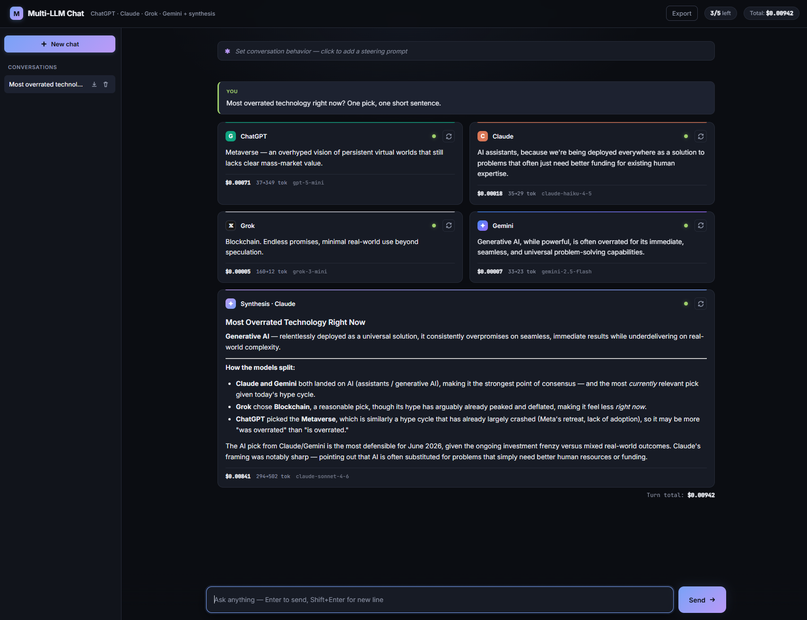

# Multi-LLM Chat

Ask **ChatGPT, Claude, Grok, and Gemini** the same question at once, watch all four
answers stream in side-by-side, then get a single synthesized answer from Claude that
reconciles them — flagging where the models agree, disagree, or look wrong.

### 🔗 Live demo: **[multi-llm-chat.fly.dev](https://multi-llm-chat.fly.dev)**

> Live on Fly.io's free tier — scales to zero when idle, so the first request after a
> quiet spell may take a second or two to wake. Rate-limited to 5 requests/hour per
> visitor.



---

## Why I built it

Different models are good at different things, and on anything subjective or uncertain
they often disagree. Asking one model gives you one opinion with no sense of how
contested the answer is. This app fans a single prompt out to four frontier models in
parallel and then has Claude synthesize the responses, so you get both the spread of
opinions *and* a reconciled take in one shot.

It's also a deliberate exercise in the harder parts of an LLM app: concurrent streaming
from four providers with different SDKs, merging those streams into one server-sent
event feed, and keeping the frontend responsive while four responses render at once.

---

## Features

- **Parallel fan-out** — one prompt hits all four providers concurrently (`asyncio.gather`); slow models never block fast ones.
- **Token-by-token streaming** — every card fills in live over a single Server-Sent Events stream. The synthesis streams in after the four answers land.
- **Claude-powered synthesis** — a fifth call reads all four answers and writes a reconciled summary, citing which model said what.
- **Multi-turn conversations** — follow-up questions include prior context. Each provider only ever sees *its own* previous answers, not the other three's.
- **Per-conversation system prompt** — steer all four models at once ("be a strict code reviewer", "answer in French", etc.).
- **Live cost tracking** — per-card token counts and USD cost, per-turn totals, and a running conversation total, computed from each model's real usage numbers.
- **Split answer/summary models** — a cheap model answers (Haiku) while a stronger one synthesizes (Sonnet), configurable per role.
- **Single-card retry** — re-run just one provider (or just the synthesis) without re-firing the whole turn.
- **Cancellation** — stop an in-flight request mid-stream (button or `Esc`) via `AbortController`.
- **Local persistence** — conversations are saved to `localStorage` with a history sidebar; nothing is stored server-side.
- **Markdown rendering** — responses render as formatted Markdown (`marked` + `DOMPurify` for XSS safety).
- **Per-IP rate limiting** — sliding-window cap on requests, configurable via env, with a "requests left" badge in the UI.
- **Resilience touches** — automatic retry on Gemini's transient 503s, and the current date injected into every system prompt so models don't default to their training cutoff.

---

## Architecture

```
                       ┌──────────── FastAPI backend ────────────┐
Browser                │                                          │
  │  POST /api/ask      │   ┌─ stream_openai  ─┐                  │
  │  (full history)     │   ├─ stream_anthropic├─ asyncio.gather  │
  ├────────────────────▶│   ├─ stream_xai      ┤   → shared queue │
  │                     │   └─ stream_gemini   ─┘        │        │
  │   text/event-stream │                                ▼        │
  │◀────────────────────│           SSE events ◀── stream_summary │
  │  (start/delta/done   │            (Claude reads all 4 answers) │
  │   per model, then    │                                         │
  │   summary_*, then    └─────────────────────────────────────────┘
  │   turn_total)
  ▼
Frontend renders each event into the matching card, throttled to one
repaint per animation frame so streaming stays smooth.
```

**Key design decisions:**

- **One SSE stream, not four.** Each provider's tokens are pushed onto a shared
  `asyncio.Queue`, tagged with the model name, and serialized to the client as a single
  event stream. The frontend routes each event to the right card by its tag. This keeps
  the client to one connection and makes the "all four at once" UX trivial to render.

- **Per-provider conversation isolation.** In a multi-turn chat, each model is only shown
  its *own* prior answers — never the other three's. Otherwise the models would start
  parroting each other and the comparison would collapse. User/assistant alternation is
  preserved (Anthropic requires it) with placeholders for any empty turns.

- **Split answer vs. summary models.** Answering is cheap and parallel; synthesis is the
  expensive, quality-sensitive step (it ingests all four answers). The app uses a cheap
  model to answer and a stronger one to synthesize — a meaningful cost reduction with no
  loss in the part that matters.

- **Prompt caching on the summarizer.** The synthesis system prompt is marked cacheable
  so repeated turns reuse the cached prefix; the volatile per-turn content goes in the
  user message to keep the cache valid.

- **Cancellation is real, not cosmetic.** The browser aborts the `fetch`; the server
  detects the disconnect and cancels the driver task, so in-flight provider calls
  actually stop instead of running to completion in the background.

- **No database.** Conversation history lives in the browser's `localStorage`. For a
  single-user app this is simpler, private (chats never touch the server), and means
  every visitor gets a clean slate.

---

## Tech stack

| Layer | Choice |
|---|---|
| Backend | Python, [FastAPI](https://fastapi.tiangolo.com/), Uvicorn |
| LLM SDKs | `anthropic`, `openai` (also used for xAI via a custom `base_url`), `google-genai` |
| Streaming | Server-Sent Events over `StreamingResponse` |
| Frontend | Vanilla HTML/CSS/JS — single `index.html`, no build step, no framework |
| Rendering | `marked` (Markdown) + `DOMPurify` (sanitization), Inter + JetBrains Mono |

No frontend framework was used on purpose — the app is small enough that vanilla JS keeps
it dependency-light and trivial to serve as a static file.

---

## Running locally

**Prerequisites:** Python 3.10+ and API keys for the providers you want to use. (The app
degrades gracefully — any provider without a key shows a "not configured" message instead
of failing the whole request.)

```bash
# 1. Clone and enter
git clone https://github.com/Tylerathomas/multi-llm-chat.git
cd multi-llm-chat

# 2. Create a virtual environment and install deps
python -m venv .venv
.venv\Scripts\activate        # Windows
# source .venv/bin/activate    # macOS / Linux
pip install -r requirements.txt

# 3. Configure keys
copy .env.example .env         # Windows  (cp on macOS/Linux)
# then edit .env and paste in your API keys

# 4. Run
uvicorn main:app --reload
```

Open **http://127.0.0.1:8000**.

### Configuration

All configuration is via `.env` (see `.env.example`):

| Variable | Purpose | Example |
|---|---|---|
| `ANTHROPIC_API_KEY` etc. | Provider API keys | — |
| `ANTHROPIC_ANSWER_MODEL` | Model used for Claude's per-card answer | `claude-haiku-4-5` |
| `ANTHROPIC_SUMMARY_MODEL` | Model used for the synthesis | `claude-sonnet-4-6` |
| `OPENAI_MODEL` / `XAI_MODEL` / `GEMINI_MODEL` | Model per provider | `gpt-5-mini`, `grok-3-mini`, `gemini-2.5-flash` |
| `RATE_LIMIT_MAX` | Requests allowed per window per IP | `5` |
| `RATE_LIMIT_WINDOW_SECONDS` | Rate-limit window length | `3600` |

---

## API

| Method | Endpoint | Purpose |
|---|---|---|
| `POST` | `/api/ask` | Fan out a prompt to all four providers + synthesis; returns an SSE stream |
| `POST` | `/api/retry` | Re-run a single provider (or just the synthesis) for the current turn |
| `GET`  | `/api/rate_limit` | Read the caller's current rate-limit state (does not consume a request) |
| `GET`  | `/` | Serve the single-page frontend |

---

## What I'd do next

- **Server-side conversation storage** so history follows you across devices (currently `localStorage`, single-device).
- **File / image upload** to use the vision-capable models on screenshots and PDFs.
- **Mobile-responsive layout** — the sidebar + 2×2 grid needs a phone-friendly mode.
- **Deploy** behind HTTPS with a hosted demo link.

---

## Notes

This is a personal project built to explore multi-provider LLM orchestration and
streaming UX. Model IDs reflect what was current at build time; providers rename and
retire models, so update the values in `.env` if a call returns a 404.
